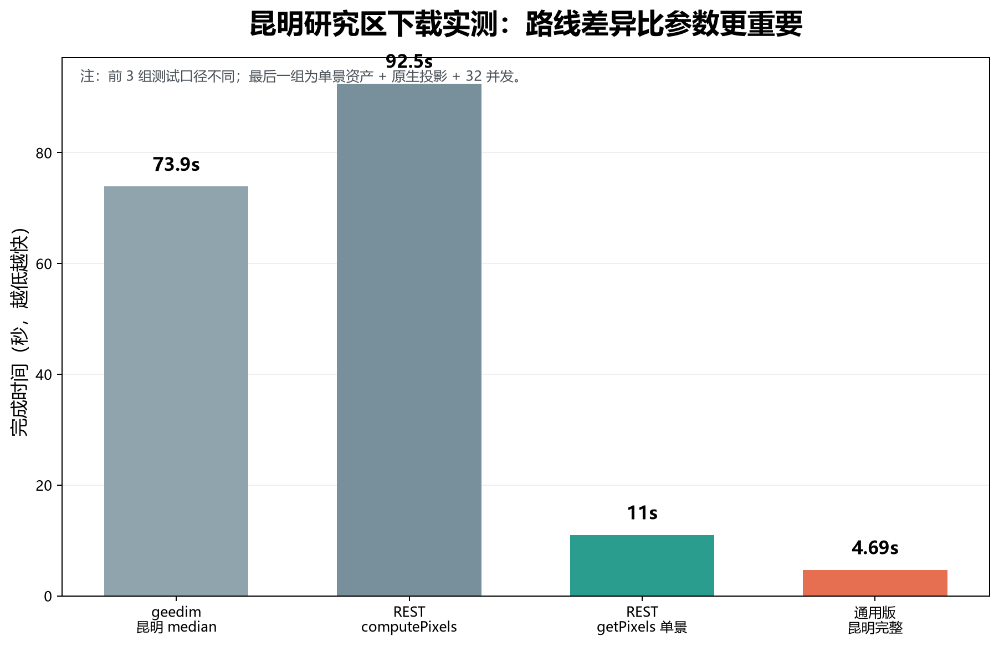
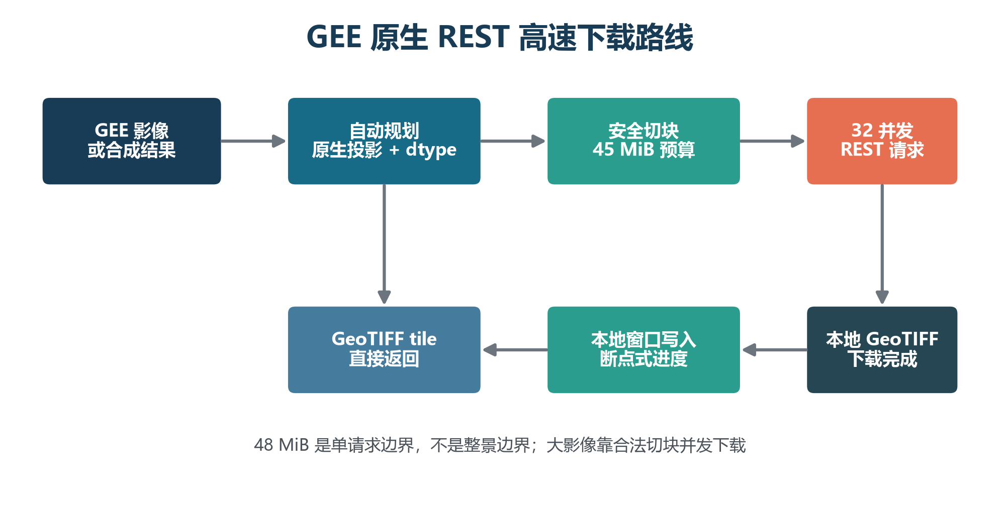
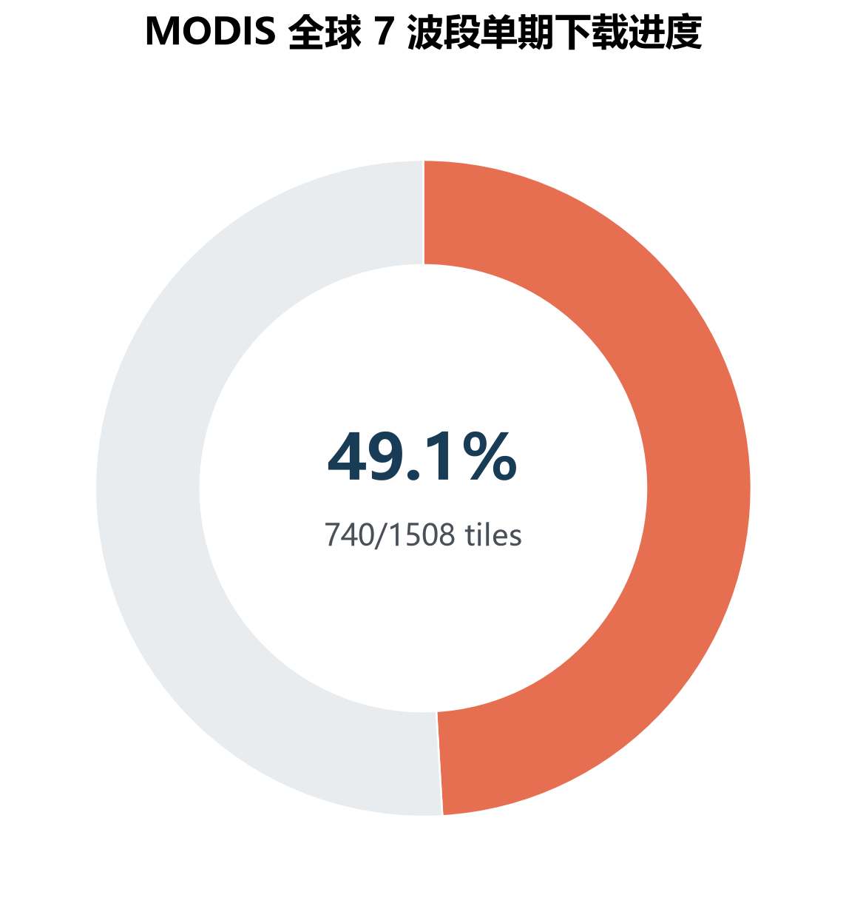

:::intro
**46 GB 级遥感数据，目标 10–20 分钟下载到本地。**

昆明市 Landsat 单景实测只用了 4 秒多；全球 MODIS 前测按原生瓦片和并发方案估算约 10–20 分钟，实际会受 GEE 服务端合成波动影响。

以前从 GEE 下载大影像，常见流程是写 Export、等任务排队、打开 Drive、再把文件搬回来。

这次我把流程做成了一个可以直接安装的 Skill：装好 GeeFast 后，只要告诉 AI“把这幅 GEE 影像下载到本地”，它会自动判断单景资产还是合成结果，自动切块、并发、重试，并把 GeoTIFF 写进指定目录。
:::

## 先看速度

昆明市 Landsat 9 单景测试，3 个波段、30 m 分辨率，完整研究区自动切成 12 个瓦片：

**实测完成时间：4.69 秒。**



*图 1｜不同下载路线的实测对比。最后一组是单景资产、原生投影和 32 并发的完整昆明研究区。*

这不是把一个小文件下载 4 秒，而是完整研究区 12 块全部返回并写成 GeoTIFF。

## 安装有多简单

### Claude Code / Codex

```text
/plugin marketplace add https://github.com/xulogin/GeeFast.git
/plugin install geefast@geefast
```

装好以后直接说：

```text
把这个 GEE 影像下载到本地，自动选择最快方案，并显示实时进度。
```

如果你已经安装了 `find-skill`，也可以直接搜索 `GEE download`、`remote sensing` 或 `Earth Engine`，再安装 GeeFast。

### Windows 上安装 find-skill

Windows 用户可以先安装 Windows 兼容版技能发现工具：

```text
npx skills add KimYx0207/findskill --skill windows -g -y
```

重启 Claude Code 或 Codex 后，可以直接说：

```text
find a skill for Google Earth Engine download
```

它会先帮你找技能，再安装选中的技能。GeeFast 的安装不需要复制凭据，也不需要把项目 ID写进代码。

## 48 MiB 到底限制了什么？

这里最容易误解：48 MiB 是 GEE `getPixels` / `computePixels` **单次交互式请求**的未压缩数据上限，不是整幅影像只能 48 MiB。

所以大影像的正确做法不是硬撑一个超大请求，而是：



*图 2｜GeeFast 的路线：原生投影 → 自动安全切块 → 合法并发 → 本地窗口写入。*

1. 优先使用影像原生投影，避免全球数据无谓重投影。
2. 根据波段数和数据类型自动计算安全瓦片大小。
3. 每个请求控制在 45 MiB 安全预算内，给掩膜和编码开销留空间。
4. 使用 20–32 个合法并发请求，遇到 429 自动退避。
5. GEE 返回 GeoTIFF 瓦片，直接写入最终本地 GeoTIFF。

压缩不能突破单请求上限；真正有效的是减少重复计算、减少转换、合理切块和并发。

## 大数据测试：全球 MODIS

我又用 `MODIS/061/MCD43A4` 做了全球单期测试：2021-01-01 至 2021-01-09，7 个反射率波段，8 景做 median，保留 MODIS 原生网格。

这类任务最终文件约 **46–49 GB 级别**，不是普通小图。前测中，1200 px 原生瓦片单块约 7.3 秒，按 2304 块估算约 **15–25 分钟**；实际时间会受到 GEE 服务端 median 计算和网络波动影响，不能把估算当作最终完成时间。



*图 3｜全球 MODIS 下载进度图。正式发布时用最终任务的完成百分比替换。*

## 这条路线适合什么情况？

### 已经存在的单景资产

这是最快的情况。GeeFast 直接使用 `getPixels`，不让 GEE 对每个瓦片重新做集合合成。昆明 4.69 秒的测试就是这条路线。

### 必须现场合成的结果

例如月度 median、年度 mosaic 或多景质量筛选，需要 `computePixels`。下载器仍然可以并发切块，但每个瓦片都要经过 GEE 服务端计算，耗时会明显受数据复杂度影响。

### 极复杂的大任务

如果合成表达式特别复杂，可以评估 Batch Export 到 Cloud Storage，再从本地并发取回。它是另一种合规的工程路线，不是绕过配额。

## 最后说清楚边界

- 不使用多账号规避限制。
- 不把 48 MiB 说成整景上限。
- 不把“单块测速”写成“整景完成时间”。
- 实测、进度和估算分开标注。
- 输出目录由用户指定，工具不擅自写入其他位置。

一句话总结：**安装 GeeFast 后，告诉 AI 你要下载什么，它负责选择路线、切块、并发和写盘；你只需要看进度。**

## 它和 geedim、Export to Drive 有什么不同？

这次测试的核心路线**没有使用 geedim，也没有使用传统的 `Export.image.toDrive`**。

传统 Export 的优点是稳定、适合批处理，但通常要创建任务、等待排队、再从 Drive 把结果搬回本地。geedim 简化了交互式下载，但它仍然受 GEE 交互式请求、瓦片策略和服务端计算延迟影响。

GeeFast 的优势在于把下载链路直接拆开控制：

- 已有单景资产直接走 `getPixels`，跳过重复合成。
- 合成结果走 `computePixels`，自动根据 48 MiB 单请求边界切块。
- 32 路合法并发请求，失败自动退避。
- GEE 返回 GeoTIFF 瓦片后直接写入本地目标文件，不经过 Drive 中转。
- 全程显示瓦片进度、耗时、文件大小和剩余估算。

所以它不是“破解 GEE”，而是把原本隐藏在 Export 任务里的切块、并发、进度和写盘过程显式化，让下载大影像时更容易测、更容易调、更容易看到结果。

## 安装超级简单，也超级好用

GeeFast 的目标不是让你再学一套复杂命令，而是把下载这件事交给 AI：安装插件以后，直接对话就可以。

而且它可以和 GeeLo 组合使用：

- **GeeLo**：帮你写 GEE 脚本，连接真实 Earth Engine，自己看报错、改代码、核对结果。
- **GeeFast**：拿到最终影像后，自动选最快下载路线、自动切块并发、直接写入本地。

一个负责“算对”，一个负责“拿快”。做遥感项目时，你只需要告诉 AI：

```text
帮我做这个区域的遥感分析，结果算通以后，直接用最快方案下载到本地，并显示进度。
```

从 GEE 脚本到本地 GeoTIFF，整个流程都可以通过和 AI 对话完成。
